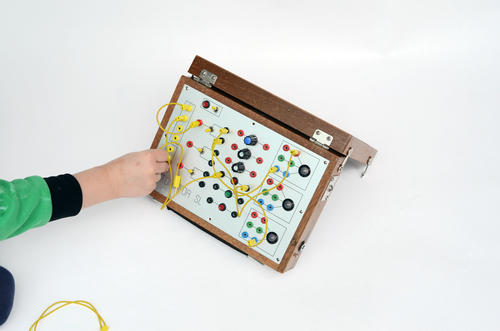

###Antonator  

Little device I built for my son. He can plug cords into sockets to get all kinds of switches to work. My wife insisted on no noise, so it only contains three large RGB-LEDs. 

Apart from the front plate nothing much here, the PIC inside just does the blinking.

###Tools

CadSoft Eagle

Microchip MPLAB IDE 7

CCS PICC C-Compiler

###License

[BSD](LICENSE-BSD.txt) for software

[Creative Commons 4.0](LICENSE-CC.txt) for pcb and other artwork

###Copyright

Copyright (c) 2012 Bjoern Seip

